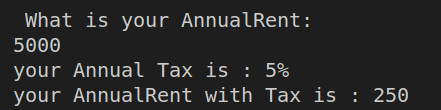
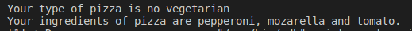

<div align = "center">

# MAIN

# EXCERSICE 1.- RENTA 

<div>

<div align= "justify">

## What is the purpose of this program? well, the program was made with a simple instruction

## This instruction is:
    The tax brackets for the declaration of income
    in a given country are the following:

    Tax rate income
    Less than $10,000 5%
    Between $10,000 and $20,000 15%
    Between $20,000 and $35,000 20%
    Between $35,000 and $60,000 30%
    More than $60,000 45%

    Write a program that asks the user for their rent
    annual and shows on the screen the tax rate that
    corresponds

<div>

<div align = "center">

# INPUT
<div>

<div align = "justify">

```c++
                        // introduce the rent account 
    cout << " What is your AnnualRent: " << endl;
    cin >> AnnualRent;
    
```
<div>

<div align = "center">

# PROCCESS
<div>

<div align = "justify">

```c++
                // the variables are validated by the functions 
    if (AnnualRent < 10000)
    {
        Tax =.05;
    }
    else if (AnnualRent >= 10000 & AnnualRent <20000 )
    {
        Tax = .15;
    }
    else if (AnnualRent >= 20000 & AnnualRent <35000)
    {
        Tax = .20;
    }
    else if (AnnualRent >= 35000 & AnnualRent < 60000)
    {
        Tax = .30;
    }
    else if (AnnualRent >= 60000 )
    {    {

        Tax = .45;
    }
    
```

<div>

<div align = "center" >

# OUTPUT 
<div>


<div align = "justify">

```c++    
                    // you can see the results in this part 
    cout << "your Annual Tax is : " << (Tax*100) << "%" << endl;
    cout << "your AnnualRent with Tax is : " << (AnnualRent*Tax) << endl;

```
<div>

<div align = "center">

## EXPLANATION
<div>

<div align = "justify">

>1. Ask the user for his annual rent.
>2. Check that the user entered a valid rent.   
>2.1 If the user does not enter a valid rent, print a message that the  user entered an incorrect number.  
>2.2 If the user entered a valid rent, continue with the program.
>3.  Check by several if's which tax rate.  
>3.1 If the rent is less than $10, 000 it is 5% (.05).  
>3.2 If the rent is greater than or equal to $10,000 and less than $20,000 it is 15% (.15).  
>3.3 If the rent is greater or equal to $20,000 and less than $35,000, it is 20% (.20).   
>3.4 If the rent is greater or equal to $35,000 and less than $60,000 it is 30% (.30).  
>3.5 If the rent is greater than $60,000 it is 45% (.45). 
>4. Multiply the rent by the tax rate.
>5. Print the tax rate and its equivalent in dollars. 

<div>

<div align = "center" >

# Texts
<div>

<div align = "justify">

## A) Rent < $10,000



## B) Rent >= $10,000 and Rent < $20,000 


## C) Rent >= $20,000 and Rent < $35,000 


## D) Rent >= $60,000


<div>

<div align= right>

[BACK TO HEAD](#MAIN)

<div align = "center">

# Exercise 2: SCORE PERFORMANCE[](#Exercise2)
<div>

<div align= "justify">

## What is the purpose of this program? well, the program was made with a simple instruction

## This instruction is:
    In a certain company, its employees are evaluated at the end of each year.
    The points that can be obtained in the evaluation start at 0.0 and can go up, translating into better benefits. 
    The points you can get employees can be 0.0, 0.4, 0.6 or more, but not intermediate values between the figures mentioned. Below is a table with thelevels corresponding to each score. The amount of money earned
    on each level is $2,400 multiplied by the level score.

    Level Score
    Unacceptable 0.0
    Acceptable 0.4
    Merit 0.6 or more

    Write a program that reads the user's score and indicates their level of performance,
    as well as the amount of money the user will receive.
    *Thank you very much for choosing us! We look forward to serving you again.

<div>


<div align = "center">

# INPUT
<div>

<div align = "justify">

```c++
                        // introduce your score 
    cout << "introduce your score"<< endl;
    cin >> score;
    performance = score*2400;
```
<div>

<div align = "center">

# PROCCESS
<div>

<div align = "justify">

```c++
                // the variables are validated by the functions 
    if (score == 0.0)
    {
        cout << "your performance are unacceptable" << endl; 
    }
    else if (((score==0.4)||(score >= 0.6))&&(score <=1))
    {
        if ((score >= 0.6) && (score <=1))
    {
        cout << "your performance are meritorious" << endl;  
    } else{
        cout << "your performance are acceptable" << endl;
        
    }
    }
```

<div>

<div align = "center" >

# OUTPUT 
<div>


<div align = "justify">

```c++    
                    // you can see the results in this part 
     cout << "your performance (money) is to  " << performance; 

```
<div>

<div align = "center">

## EXPLANATION
<div>

<div align = "justify">

>1. Ask the user for his score.
>2. Check that the user entered a score greater than or equal to 0.6 or equal to 0.4..   
>2.1 If the user does not enter a valid score print Your score is unacceptable message. ---------
>2.2 If the user entered a valid score, continue with the program.
>3. Multiply your score by 2400 and store the cash value.
>4. Check what kind of score you obtained  
>4.1 If your score is greater than or equal to 0.6 print your score is Meritorious.  
>4.2 If your score is equal to 0.4 print your score is Acceptable.
>5. Print the amount of money.

<div>

<div align = "center" >

# Texts
<div>

<div align="justify">

### A) score >= 0.6


### B) score == 0.4


### C) score == 0


# Exercise 3: A program that asks for your age and print the cost of ticked.[](#Exercise3)

## What is the purpose of this program? well, the program was made with a simple instruction

## This instruction is:
    Write a program for a company that has game rooms for all ages and
    you want to automatically calculate the price you should charge your customers to enter. The
    The program must ask the user for the customer's age and display the price of the ticket. Yes
    the client is under 4 years old can enter for free, if he is between 4 and 18 years old he must pay $5 and
    if you are over 18, $10
<div>


<div align = "center">

# INPUT
<div>

<div align = "justify">

```c++
                        // introduce your score 
    cout << " How old are you ? " << endl;      
    cin >> edad;
```
<div>

<div align = "center">

# PROCCESS
<div>

<div align = "justify">

```c++
                // the variables are validated by the functions 
    if ((edad == 1 || edad <4))
    {
        cout << "You enter free congratulations !! " << endl;
    }   
    else if (edad >= 4 && edad < 18)
    {
        cout << "You have to pay $5 dollars " <<endl;
    }
```
<div>

<div align = "center" >

# OUTPUT 
<div>

<div align = "justify">

```c++    
                    // you can see the results in this part 
     else
    {
        cout << "You have to pay $10 dollars " <<endl;
    }    
```
<div>

<div align = "center">

## EXPLANATION
<div>

<div align = "justify">

>1. Ask the user for your age.
>2. Check that the user enters an age within the following range.  
>2.1 If the user enters an age lower than 0, a message "Your age is invalid" will be printed.  
>2.2 If the user enters a number between 4 and 0, the ticket price is 0.  
>2.3 If the user enters an age greater than 4 and less than 18, the ticket price is 5.  
>2.4 If the user enters an age greater than 18, the ticket price is 10.
>3. Print ticket cost.   

<div>

<div align = "center">

## Texts.
<div>

<div align = "justify">

### Age > 18


### Age >= 4 and Age <=18


### Age < 4 and Age > 0

<div>

<div align="right">

</div>

# Exercise 4: Menu of a Bella Napoli pizzeria showing your type of pizza and ingredients[](#Exercise4)

## What is the purpose of this program? well, the program was made with a simple instruction

## This instruction is:
    The Bella Napoli pizzeria offers vegetarian and non-vegetarian pizzas to its customers. The
    Ingredients for each type of pizza are listed below.

     Vegetarian ingredients: Pepper and tofu.
     Non-vegetarian ingredients: Pepperoni, Ham and Salmon.

    Write a program that asks the user if he wants a vegetarian pizza or not, and in
    Based on your answer, show you a menu with the ingredients available for you to choose from.
    You can only choose one ingredient besides the mozzarella and the tomato that are in all the
    pizza.
    At the end it should be shown on the screen if the chosen pizza is vegetarian or not and all the
    ingredients it carries
<div>


<div align = "center">

# INPUT
<div>

<div align = "justify">

```c++
                        // introduce your score 
    cout << "Welcome to Pizzas Bella Napoli" << endl << "What pizza do  you like? Vegetarian or Not vegetarian" << endl;
    cout << "if you choose the vegetarian pizza enter number 1" << endl << "if you choose the not vegetarian pizza enter number 2" << endl;
    cin >> type;
```
<div>

<div align = "center">

# PROCCESS
<div>

<div align = "justify">

```c++
                // the variables are validated by the functions 
     if (type == 1)
    {
        type_1 = "vegetarian";
        cout << "All include mozarella and tomato."<< endl;
        cout << "The ingredients are: \n";
        cout << "1.-Pepper. \n";
        cout << "2.-Tofu. \n";
        cout << "choose the number do you like in your pizza" << endl;
        cin >> vegetarian_ingredient;

        //choose ingredient pepper

        if (vegetarian_ingredient == 1)
        {
            ingredient_extra = "pepper";
        }   
        //choose tofu
        else if (vegetarian_ingredient == 2)
        {
            ingredient_extra = "tofu";
        }
   }
    else if (type == 2)
    {
        type_2="no vegetarian";
        cout << "All include mozarella and tomato."<< endl;
        cout << "The ingredients are: \n";
        cout << "1.-Pepperoni. \n";
        cout << "2.-Ham. \n";
        cout << "3.- Salmon. \n";           
        cout << "choose the number do you like in your pizza" << endl;
        cin >> novegetarian_ingredient;

        //choose ingredient pepperoni

        if (novegetarian_ingredient == 1)
        {
            ingredient_extra = "pepperoni";
        }   
        //choose ingredient ham
        else if (novegetarian_ingredient == 2)
        {
            ingredient_extra = "ham";
        }
        //choose ingredient salmon
        else if (novegetarian_ingredient == 3)
        {
            ingredient_extra = "salmon";
        }
   }
    else
    {
        cout << "your type of pizza dont exist" << endl;
    }
```
<div>

<div align = "center" >

# OUTPUT 
<div>

<div align = "justify">

```c++    
                    // you can see the results in this part 
     if (type == 1 )
    {   
        cout << "Your type of pizza is " << type_1 << endl;
        cout << "Your ingredients of pizza are " << ingredient_extra << ", mozarella and tomato. \n";
    }
    else
    {
        cout << "Your type of pizza is " << type_2 << endl;
        cout << "Your ingredients of pizza are " << ingredient_extra << ", mozarella and tomato. \n";
    }  
```
<div>

<div align = "center">

## EXPLANATION
<div>

<div align ="justify">

>1. Ask the user what type of pizza he/she prefers:  
1.1 If any number but 1 or 2 is selected it prints "That type of pizza doesn't exit".   
1.2 If he selects 1 he enters the vegetarian ingredients menu.  
1.3 If he selects 2 he enters the no vegetarian ingredients menu. 
>2. Display the menu depending on your type of pizza.
>3. Ask what ingredients you want on your pizza.
>4. Save the ingredients in a string.
>5. Show your type of pizza (vegetarian or non-vegetarian) and the ingredients.

<div>

<div align = "center">

## Texts.
<div>

<div align= "justify">

### Type:Vegetarian Ingredient: Pepper
 

### Type:Vegetarian Ingredient: Tofu
 

### Type:No Vegetarian Ingredient: Pepperoni
 

### Type:No Vegetarian Ingredient: Ham
 

### Type:No Vegetarian Ingredient: Salmon
 

 <div>

<div align="right">


</div>

# Exercise 5 Ask the user 6 temperature and print the mean, highest and lowest temperature.[](#Exercise5)

<div align = "center">

# INPUT
<div>

<div align = "justify">

```c++
                        // introduce your score 
    do
    {
        cout << "give me the temperature" << endl;
        cin >> temperature;
        tempeAcum +=temperature;

        contator ++;
```
<div>

<div align = "center">

# PROCCESS
<div>

<div align = "justify">

```c++
                // the variables are validated by the functions 
     if (temperature <= temperature_min)
        {
            temperature_min=temperature;
        }
        if (temperature >= temperature_max)
        {
            temperature_max=temperature;
        }
    } while (contator <=6);
```
<div>

<div align = "center" >

# OUTPUT 
<div>

<div align = "justify">

```c++    
                    // you can see the results in this part 
    cout << "the average of temperature today is : " << tempeAcum/6 <<endl;
    cout << "the temperature min is " << temperature_min<< endl;
    cout << "the temperature max is " << temperature_max << endl;
```
<div>

<div align = "center">

## EXPLANATION
<div>

<div align="justify">

>1. Ask the user 6 temperature.
>2. If temparures is higher than the previous one, it save it.
>3. If temparures is lower than the previous one, it save it.
>4. Print the mean, highest and lower temperature.
<div>

<div align="center">

## Texts.
<div>


<div align="right">

</div>

# Exercise 6: Ask the user indefinitely the amount and price of the products, finally print the total price.

<div align = "center">

# INPUT
<div>

<div align = "justify">

```c++
                        // introduce your score 
    do
    {
        cout << "introduce your amount of products" << endl ;
        cin >> amount;
```
<div>

<div align = "center">

# PROCCESS
<div>

<div align = "justify">

```c++
                // the variables are validated by the functions 
     if (amount !=0 & amount >0)
        {
            cout << "introduce the price of products" << endl;
            cin >> price;

        }
        else {
            cout << "tu amount dont exist" << endl;

        }
            

        amount_total += price*amount;


    } while (amount !=0);
```
<div>

<div align = "center" >

# OUTPUT 
<div>

<div align = "justify">

```c++    
                    // you can see the results in this part 
        cout << "your amount total to pay is  : " << amount_total;
```
<div>

<div align="center">

## EXPLANATION
<div>

<div align="justify">

>1. Ask the user the amount. 
>2. Ask the user the price.
>3. If the user enter 0 in amount, exit the cycle.
>4. Print the total price of all products.
<div>

<div align="center">

## Texts.
<div>

  


<div align="right">

</div>

# Exercise 7: Decimal to Binary
<div align = "center">

# INPUT
<div>

<div align = "justify">

```c++
                        // introduce your score 
    // Ask the number
   cout << "Enter the number: ";
   cin >> numero;    
```
<div>

<div align = "center">

# PROCCESS
<div>

<div align = "justify">

```c++
                // the variables are validated by the functions 
      // Cycle to divide the number by 2 and print the ramainder.
   while (numero != 0)
   {
       // resultado=to_string(numero%2)+resultado;
       resultado = (numero % 2 == 0) ? "0" + resultado : "1" + resultado;
       numero /= 2;
   }
   // Print the binary number
   cout << "The number in binary is " << resultado << endl;  
```
<div>

<div align = "center" >

# OUTPUT 
<div>

<div align = "justify">

```c++    
                    // you can see the results in this part 
         // if (numero >= 0) Print the binary number
    cout << "The number in binary is " << resultado << endl;
    // if (numero < 0 ) Print the error message.
    cout << "Only accept numbers greater then or equal to 0. \n";
```
<div>

<div align="center">

## EXPLANATION
<div>

>1. Ask the number.
>2. If the number greater than or equal 0.  
>2.1 Enter a cycle to divide the number by 2 and print the ramainer.
>3. If the number less than 0.  
>3.1 Print the error message.

<div align = "center">

## Texts.
<div>

### Number >= 0


### Number < 0


<div align="center">

</div>

# Exercise 8: Multiplication tables

<div align = "center"> 

# INPUT
 <div>

 <div align = "justify">

 ```c++
    // Ask the user for the number
   cout << "enter the number you want to multiply" << endl;
    cin >> numero1;

    cout << "enter the number of times you want to multiply it" << endl;
    cin >> numero2;
```
 <div align = "center">

# PROCCESS
<div>

 <div align = "justify">

 ```c++
    if (numero < 0)
    {
        for (int i = 0; i >= limite; i--)
        {
            // If and for to print the firts line of -
            if (i == 0)
            {
                for (int f = 0; f <= 41; f++)
                {
                    cout << "-";
                }
                cout << "\n";
            }

            // Print the formatted table.
            cout << "|  " << i << "\t x \t" << numero << "\t = \t" << (i * numero) << "\t |\n";

            // For to print line of -
            for (int f = 0; f <= 41; f++)
            {
                cout << "-";
            }
            cout << "\n";
        }
    }
    else
    {
        for (int i = 0; i <= limite; i++)
        {
            // If and for to print the firts line of -
            if (i == 0)
            {
                for (int f = 0; f <= 41; f++)
                {
                    cout << "-";
                }
                cout << "\n";
            }

            // Print the formatted table.
            cout << "|  " << i << "\t x \t" << numero << "\t = \t" << (i * numero) << "\t |\n";

            // For to print line of -
            for (int f = 0; f <= 41; f++)
            {
                cout << "-";
            }
            cout << "\n";
        }
    } 
```
<div>

 <div align = "center">

# OUTPUT
<div>

 <div align = "justify">

```c++
    if (i == 0)
    {
        for (int f = 0; f <= 41; f++)
        {
            cout << "-";
        }
        cout << "\n";
    }
    // Print the formatted table.
    cout << "|  " << i << "\t x \t" << numero << "\t = \t" << (i * numero) << "\t |\n";
        
    // For to print line of -
    for (int f = 0; f <= 41; f++)
    {
    cout << "-";
    }
    cout << "\n";
```
<div>

 <div align = "center">

## EXPLANATION
<div>

 <div align = "justify">

>1. Ask the user for the number. 
>2. Ask the user for the limit
>3. Print the  multiplication table up to the limit number entered.
<div>

<div align = "center">

## Texts.
<div>

### Positive number and positive limit

  
### Negative number and negative number


