<div align = "center">

# UNIT 2.- Contro structures and Cycles

# EXCERSICE 1.- RENT 

# INPUT

</div>

```c++
    cout << " What is your rent per year?\n ";
    cin >> PagoInicial;
    
```
<div>


# PROCESS
<div>


```c++
    if (PagoInicial < 10000){
        PagoExtra =.05;
    }
    else if (PagoInicial >= 10000 & PagoInicial <20000 ){
        PagoExtra = .15;
    }
    else if (PagoInicial >= 20000 & PagoInicial <35000){
        PagoExtra = .20;
    }
    else if (PagoInicial >= 35000 & PagoInicial < 60000){
        PagoExtra = .30;
    }
    else if (PagoInicial >= 60000 ){
        PagoExtra = .45;
    }
    
```

<div>

<div align = "center" >

# OUTPUT 
<div>


<div align = "justify">

```c++    
    cout << "Your tax fee is : " << (PagoExtra*100) << "%" << endl << "The total amount of rent should be : " << (PagoInicial*PagoExtra) << endl;


```
<div>

<div align = "center">

## EXPLANATION
<div>

<div align = "justify">

This program is for calculating taxes based on rent given by the user:  
Rent   &ensp; &ensp;&ensp;&ensp; &ensp;&ensp;&ensp;&ensp;&ensp;&ensp;&ensp;&ensp;&ensp;&ensp;&ensp; Extra  
 -$10,000 &ensp;&ensp;&ensp;&ensp;&ensp;&ensp;&ensp;&ensp;&ensp;&ensp;	5%  
 +$10,000  -$20,000 &ensp;	15%  
 +$20,000 -$35,000	&ensp;&ensp;20%  
 +$35,000 -$60,000&ensp;&ensp;	30%  
 +$60,000	&ensp;&ensp;&ensp;&ensp;&ensp;&ensp;&ensp;&ensp;&ensp;&ensp;&ensp;45%  

<div>

<div align = "center" >

# TESTS<div>

<div align = "justify">

## A) Rent < $10,000
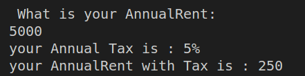


## B) Rent >= $10,000 and Rent < $20,000 
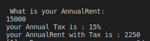

## C) Rent >= $20,000 and Rent < $35,000 
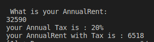

## D) Rent >= $60,000
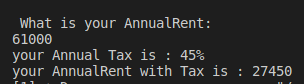

<div>

<div align= right>


<div align = "center">

# Exercise 2: WORK PERFORMANCE
<div>


<div align = "center">

# INPUT
</div>
</div></div></div>

```c++
    cout << "How well has the employee behaved:\n";
    cin >> desempeno;
```
<div>

<div align = "center">

# PROCESS
</div>


```c++
    dineroextra = desempeno*2400;//Cantidad inicial de dinero
    
    if (desempeno == 0.0)
    {
        cout << "An unacceptable performance\n"; 
        cout << "Your extra money is  " << dineroextra; 
    }
    else if ((desempeno >= 0.6) && (desempeno <=1))
    {
        cout << "A meritorous performance\n";  
        cout << "Your extra money is  " << dineroextra; 
    } else if (desempeno == 0.4){
        cout << "An acceptable performance\n";
        cout << "Your extra money is  " << dineroextra; 
    }else{
        cout << "Invalid performance, try again.";
    }
```

<div>

<div align = "center" >

# OUTPUT 
</div>


```c++    
        cout << "Your extra money is  " << dineroextra; 

```
<div>

<div align = "center">

## EXPLANATION
<div>

<div align = "justify">

The program is for calculating how much extra money should employees get based on their performance. $2400 is the optimal amount and it gets modified by the employee score. It can't receive values between 0-0.4 and 0.4-0.6.

<div>

<div align = "center" >

# TESTS<div>

<div align="justify">

### A) score >= 0.6
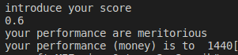

### B) score == 0.4
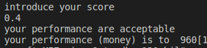

### C) score == 0
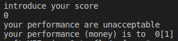
<br /><br /><br /><br />
<div align = "center" >

# Exercise 3: Entry cost

<div align = "center">

# INPUT
<div>

<div align = "justify">

```c++
    cout << " How old are you ? \n";      
    cin >> edad;
```
<div>

<div align = "center">

# PROCESS
<div>

<div align = "justify">

```c++
    if ((edad == 1 || edad <4))//If the kid has less then 3 years, free entry
    {
        precio = 0;
    }   
    else if (edad >= 4 && edad < 18)//If the kid has less than 18, $5
    {
        precio = 5;
    }
    else//If the client has more than 18, $10
    {
        precio = 10;
    }               
```
<div>

<div align = "center" >

# OUTPUT 
<div>

<div align = "justify">

```c++    
    cout << "Your entry price is: $" << precio << " thanks for visiting us!\n";

```
<div>

<div align = "center">

## EXPLANATION
<div>

<div align = "justify">

The program asks the user their age. If they're under 4 years old, the price is 0; if they are under 18 y/o, they pay $5. If they are over 18 years old they pay $10.

<div>

<div align = "center">

## TESTS
<div>

<div align = "justify">

### Age > 18
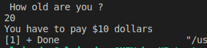

### Age >= 4 and Age <=18
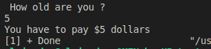

### Age < 4 and Age > 0
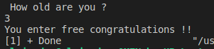
<div>

<div align="right">

</div><br /><br /><br /><br />

# Exercise 4: Vegetarian or Meat Pizza


<div align = "center">

# INPUT
<div>

<div align = "justify">

```c++
    cout << "Do you want a Vegetarian pizza(V) or a carnivore pizza(C)? (V/C)\n";
    cin >> response;
```
<div>

<div align = "center">

# PROCESS
<div>

<div align = "justify">

```c++
    if (response == 'V' || response == 'C') // La respuesta es valida si o no
    {
        if (response == 'V') // Vegetarianas
        {
            do
            {
                cout << "Extra ingredient: \n 1. Pepper\n 2. Tofu\n"; // Dowhile hasta ingrediente correcto
                cin >> ingrediente;
            } while (ingrediente < 1 || ingrediente > 2);
        } else if (response == 'C') // Carnivoras
        {
            do
            {
                cout << "Extra ingredient: \n 1. Pepperoni\n 2. Ham\n 3. Salmon\n"; // Dowhile hasta ingrediente correcto
                cin >> ingrediente;
            } while (ingrediente < 1 || ingrediente > 3);
            iniciaen = 1;  // Lugar de ingredientes de carne
            seleccion = 1; // Mostrar que la pizza es de carne
        } 
```
<div>

<div align = "center" >

# OUTPUT 
<div>

<div align = "justify">

```c++    
        cout << "Your " << tipopizza[seleccion] << " pizza has the following ingredients:\n Mozarella \n Tomato\n ";
        cout << ingredienteextra[ingrediente + iniciaen] << endl; // Ingrediente extra
    }
    else
    {
        cout << "You've inputted an invalid response, try again\n";
    }
```
<div>

<div align = "center">

## EXPLANATION
<div>

<div align ="justify">

The program asks the user about what kind of pizza they would like: VEGETARIAN or MEAT PIZZA. Based on their decision they can choose one extra ingredient: Pepper or tofu if vegetarian, Pepperoni, salmon and ham if meat pizza. The program then enlists the final ingredient selection alongside the type of pizza.

<div>

<div align = "center">

## TESTS
<div>

<div align= "justify">

### Type:Vegetarian Ingredient: Pepper
 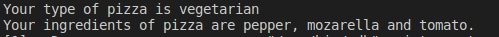

### Type:Vegetarian Ingredient: Tofu
 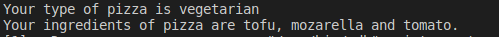

### Type:No Vegetarian Ingredient: Pepperoni
 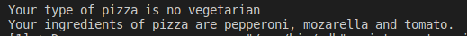

### Type:No Vegetarian Ingredient: Ham
 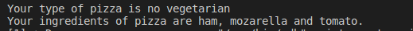

### Type:No Vegetarian Ingredient: Salmon
 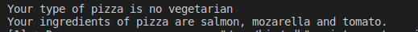

 <div>

<div align="right">


</div><br /><br /><br /><br />

# Exercise 5 Average, minium and maxium of 6 temperatures

<div align = "center">

# INPUT
<div>

<div align = "justify">

```c++
        cout << "Whats the temperatura?\n";
        cin >> temperatura;
```
<div>

<div align = "center">

# PROCESS
<div>

<div align = "justify">

```c++
        Temperaturaacumulada +=temperatura;
        contador ++;
        if (temperatura <= temperaturaminima)//Checar si la temperatura ingresada es menor a la minima
        {
            temperaturaminima=temperatura;//Reemplazar
        }
        if (temperatura >= temperaturamaxima)//Checar si la temperatura ingresada es mayor a la maxima
        {
            temperaturamaxima=temperatura;//Reemplazar
        }
    } while (contador <=6);
```
<div>

<div align = "center" >

# OUTPUT 
<div>

<div align = "justify">

```c++    
    cout << "Average temperature: " << Temperaturaacumulada/6 <<"\n";
    cout << "Minium temperature: " << temperaturaminima<< "\n";
    cout << "Maxium temperature: " << temperaturamaxima << "\n";
```
<div>

<div align = "center">

## EXPLANATION
<div>

<div align="justify">

Ask 6 temperatures to the user, calculate the average, the minium and the maxium temperature values inputted.
<div>

<div align="center">

## TESTS
<div>


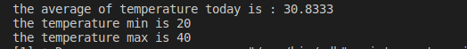

<div align="right">

</div>

# Exercise 6: Sales by the user. Exit when amount of products sold is 0.

<div align = "center">

# INPUT
<div>

<div align = "justify">

```c++
        cout << "How many products did you sell\n";
        cin >> cantidad;
```
<div>

<div align = "center">

# PROCESS
<div>

<div align = "justify">

```c++
        if (cantidad > 0)
        {
            cout << "Price of each product individually\n";
            cin >> precio;
        }
        else
        {
            cout << "Invalid amount\n";
        }
        montototal += precio * cantidad;

    } while (cantidad != 0); // End loop if the amount is 0
```
<div>

<div align = "center" >

# OUTPUT 
<div>

<div align = "justify">

```c++    
    cout << "Congratulations, you earned : $" << montototal;
```
<div>

<div align="center">

## EXPLANATION
<div>

<div align="justify">

The program calculates the total amount of sales by the user. It asks for amount and price of each product individually. If the amount equals 0, exit the program.<br />
<div>

<div align="center">

## TESTS
<div>

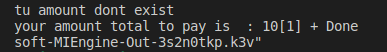  


<div align="right">

</div><br /><br /><br /><br />

# Exercise 7: Decimal to Binary
<div align = "center">

# INPUT
<div>

<div align = "justify">

```c++
    cout << "Enter the number: ";
    cin >> numero;
```
<div>

<div align = "center">

# PROCESS
<div>

<div align = "justify">

```c++
    if (numero > 0)
    {
        while (numero != 0)
        {
            resultado = (numero % 2 == 0) ? "0" + resultado : "1" + resultado;
            numero /= 2;
        }
```
<div>

<div align = "center" >

# OUTPUT 
<div>

<div align = "justify">

```c++    
        cout << "The number in binary is " << resultado << endl;
    }
    else if (numero == 0)
    {
        cout << "The number in binary is 0 \n";
    }
    else
    {
        cout << "Invalid number \n";
    }
```
<div>

<div align="center">

## EXPLANATION
<div>
The program transforms a decimal number to binary through the use of strings and residues in a division.

<div align = "center">

## TESTS
<div>

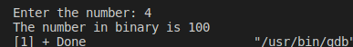

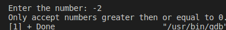

<div align="center">

</div>

# Exercise 8: Product table

<div align = "center"> 

# INPUT
 <div>

 <div align = "justify">

 ```c++
    cout << "Number to multiply\n"; // Numero a multiplicar X * 1, X * 2,...
    cin >> multiplicador;

    cout << "How many times do you wish to multiply is\n";
    cin >> numerodeveces; // Cuantas veces multiplicar el numero
```
 <div align = "center">

# PROCESS
<div>

 <div align = "justify">

 ```c++
    for (int i = 1; i <= numerodeveces; i++)
    {

        for (int j = 0; j <= 41; j++)
        {
            cout << "-";
        }
        cout << "\t\n";
    }
```
<div>

 <div align = "center">

# OUTPUT
<div>

 <div align = "justify">

```c++
        cout << "| " << multiplicador << "\t X \t" << i << "\t = \t" << multiplicador * i << "\t |\n";//Tabla
```
<div>

 <div align = "center">

## EXPLANATION
<div>

 <div align = "justify">

The program asks for a number to multiply by in a form of escalation (X*1,X*2,X*3,X*4,...). It then prints out everything in a table format
<div>

<div align = "center">

## TESTS
<div>

### Positive number and positive limit
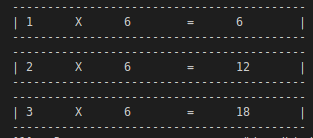
  
### Negative number and negative number
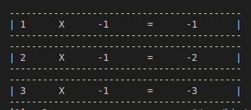

<br /><br /><br /><br /><br /><br />

# Exercise 9: Bisection Method

<div align = "center"> 

# INPUT
 <div>

 <div align = "justify">

 ```c++
    cout << "FORMULA x²+x-12 \n";
    cout << "GIVE ME A";
    cin >> a;
    cout << "GIVE ME B";
    cin >> b;
```
 <div align = "center">

# PROCESS
<div>

 <div align = "justify">

 ```c++
    ya = biseccion(a);//Usar una fucnion float para calcular la biseccion en a,b,c
    yb = biseccion(b);
    yc = biseccion(c);
    if ((yb * ya < 0) || (ya * yc < 0) || (yc * yb < 0)){//Primero checar si hay raiz entre los numeros
    cout << "| Repetition # \t|\t A \t\t|\t B\t\t|\t C \t\t|\t f(A) \t\t\t|\t f(B) \t\t\t|\t f(C) \t\t| \n";//Encabezado
    lineas();
    cout << "| \t" << contador << "\t|\t" << fixed << setprecision(3) << a << "\t\t|\t" << b << "\t\t|\t" << c << "\t\t|\t" << ya << "\t\t\t|\t" << yb << "\t\t\t|\t" << yc << "\t\t|\n"; //First data before anything
    lineas();

        while (yc >= 0.01 || yc <= -0.01)
        {
            if ((yc > 0 && ya < 0) || (ya > 0 && yc < 0))//B ahora actua como C para que se vaya cortando a la mitad
            {
                b = c;
            }
            else
            {
                a = c;
            }
            if (a == b)//Si es igual que b salte del loop
            {
                break;
            }
            
            c = (a+b)/2;
            ya = biseccion(a);
            yb = biseccion(b);
            yc = biseccion(c);
            contador++;
            cout << "| \t" << contador << "\t|\t" << fixed << setprecision(3)/* Para no imprimir tantos decimales*/ << a << "\t\t|\t" << b << "\t\t|\t" << c << "\t\t|\t" << ya << "\t\t\t|\t" << yb << "\t\t\t|\t" << yc << "\t\t|\n";
            lineas();
        }
```
<div>

 <div align = "center">

# OUTPUT
<div>

 <div align = "justify">

```c++
    cout << "The root is approximately " << setprecision(1) <<  c;
    }
    else //No hay raiz
    {
        cout << "There's no root between the numbers";
    }
```
<div>

 <div align = "center">

## EXPLANATION
<div>

 <div align = "justify">

The program calculates the root in a graph using the bisections method which basically involves cutting each section of a graph in half(while a number is negative and the other positive) until the halves meet in a point where they are both the same.
<div>

<div align = "center">

## TESTS